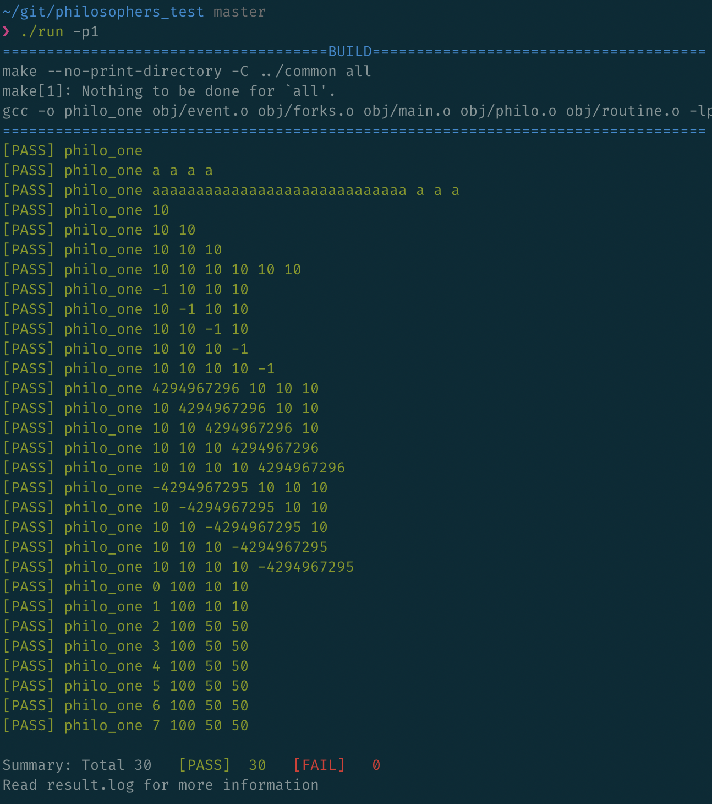

# philosophers test

Test for the philosophers project of school 42.



## Usage

Clone this repository next to your project directory.
(or change the default path in the [config](src/config.py))

```
.
|- philosophers/
|- philosophers_test/
```

```
$ ./run --help
usage: run [-h] -p {0,1,2,3} [-b] [-g] [-t TIMEOUT]

Philosophers test

optional arguments:
  -h, --help            show this help message and exit
  -p {0,1,2,3}, --philo {0,1,2,3}
                        Number of the philosopher program to test
                         - 1: philo_one
                         - 2: philo_two
                         - 3: philo_three
                         - 0: all programs
  -b, --build           Build and exit
  -g, --pager           Open result.log in a pager after the test
  -t TIMEOUT, --timeout TIMEOUT
                        Change the philosopher process time (in seconds)

Tested:
 - Take 2 forks before eating
 - State switch in the correct order
   think -> fork -> fork -> eat n times -> sleep
 - Almost 0 delay between second fork taken and eat
 - Die if the death timeout is expired
 - No output after death
 - Timestamp in order
 - Only take existing fork
 - Error message and status != 0 on argument error
   (not asked by subject but easy to do and cleanner)
```
